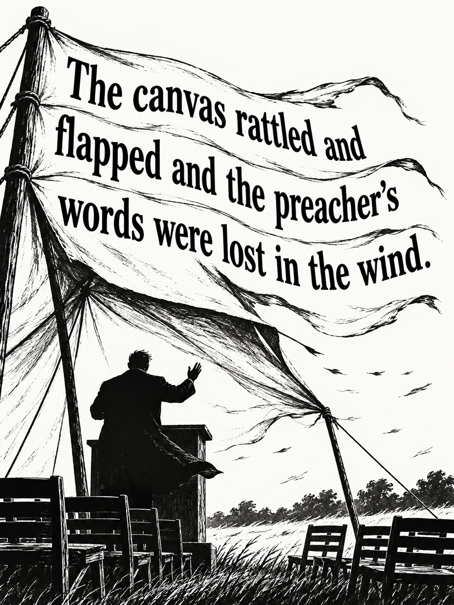

# Highlights to Art

Turn your reading highlights into monochrome illustrated quotations for e-ink.

Connect a Kindle, select its five newest highlights, and generate artwork with OpenAI or Grok. The project preserves the original quotation, produces device-sized PNG files, and keeps images that fail text validation out of the published pool.

This is an experimental command-line project for macOS and Linux. Standard Kindle reading and USB highlight import are the primary workflow. Custom sleep-screen display is a separate, optional device setup; this tool does not unlock that feature on a stock Kindle.

## Examples

These selected images were generated from real reading highlights using OpenAI ImageGen with an earlier prompt. They are AI interpretations, not original book illustrations or evidence of device validation. The current default prompt adds stronger mood and context guidance; see [prompt design and evaluation](docs/prompt-design.md).

| Words lost in the wind | A name at odds with its purpose |
| --- | --- |
|  |  |
| Cormac McCarthy, *All the Pretty Horses*. The text follows the straining canvas. | George Orwell, *1984*. The image interprets the contrast between the ministry's name and function. |

Only these selected examples are public; the private highlight library and generation history are not included.

## Start with your Kindle

You need Python 3.11+, Tesseract, and your own API key for one image provider. Generation uses that provider's paid API; a ChatGPT or Grok app subscription is not the API credential.

Install OCR on macOS:

```sh
brew install tesseract
# Optional for Russian and other languages:
brew install tesseract-lang
```

Or on Ubuntu:

```sh
sudo apt-get install tesseract-ocr tesseract-ocr-eng
# Optional for Russian highlights:
sudo apt-get install tesseract-ocr-rus
```

From a checkout of this repository:

```sh
git clone https://github.com/sergedoub/highlights-to-art.git
cd highlights-to-art
python3 -m venv .venv
. .venv/bin/activate
pip install -e '.[dev]'
cp config.example.toml config.toml
cp .env.example .env
```

Set `OPENAI_API_KEY` in the local `.env` file or your environment. Do not commit the key. OpenAI is the example default; see [provider configuration](docs/providers.md) for Grok or a new adapter. Run `highlight-art doctor` to check local prerequisites without printing credentials.

Connect your Kindle with a data-capable USB cable and confirm USB drive mode. On macOS, select the newest five highlights without generating anything:

```sh
highlight-art latest --clippings '/Volumes/Kindle/documents/My Clippings.txt' --count 5
```

On Linux, pass the actual mounted path. A previously copied `My Clippings.txt` works too. Devices exposed through MTP must first have that file copied locally using an MTP-capable file manager; automatic MTP access is not implemented.

Review the selected text, then generate:

```sh
highlight-art latest --clippings '/Volumes/Kindle/documents/My Clippings.txt' --count 5 --generate
```

The same command performs import, date parsing, deduplication, selection, generation, conversion and OCR. It only reads the Kindle file; it does not change the device. Without `--clippings`, it selects from previously imported Kindle records.

## What you get

The command prints a JSON report and saves it under `var/runs/<run-id>/report.json`. Each selected highlight has its exact prompt, original generated image, converted `kindle.png`, and validation result. The default device output is a 1264 × 1680 grayscale palette PNG without transparency or an ICC profile. Change dimensions for another screen in `config.toml`.

- `validated`: format checks and exact-text OCR passed; the image enters `var/backgrounds/` and the relay manifest.
- `needs_review`: the image exists, but OCR did not exactly match. It stays available for inspection and is not published.
- `failed`: generation, conversion or validation failed. The run continues with the other selected highlights.
- `budget_exhausted` or `over_character_limit`: that selected highlight was not generated. An older or shorter highlight is never silently substituted.

Exit code `0` means selection succeeded, or every selected generated image validated. Exit code `2` means a generation run needs attention; its report and any generated images are still saved. Exit code `1` indicates setup or input failure.

OCR tries several full-image layout modes and the configured languages individually as well as together; it never edits the recognized words to force a match. OCR is deliberately strict: only Unicode normalization and whitespace layout differences are ignored. Punctuation, capitalization, word order, missing words and extra writing matter. Correct images can produce false negatives, and an OCR pass is not a guarantee of literary quality. Inspect both the quotation and the artwork before device use.

For Russian and English together, install the corresponding OCR data and set `ocr_languages = "eng+rus"`. OCR prerequisites are checked before any paid request.

Recheck saved images after improving OCR or installing language data, with no image-provider calls:

```sh
highlight-art recheck RUN_ID
```

Use the run ID printed in the generation report. This writes a separate `recheck-report.json`, preserving the original generation report.

## Cost and repeat runs

The example configuration allows at most five image API calls per run. There is one request per selected highlight, no automatic paid retry, and no automatic provider fallback. Failed or interrupted attempts are recorded because a timed-out request may still have been billed.

Unchanged selections, prompts and provider settings reuse cached outcomes. Use `--retry --generate` only when you deliberately want to pay for new attempts. Changing a prompt, model, provider, size or other generation setting creates a new request identity. Run selection without `--generate` when you only want to inspect highlights.

`character_limit = 0` applies no length filter to the newest-highlight workflow. A positive limit marks longer selections as skipped without truncating them. Very long quotations can be difficult to render and read.

## Prompts and providers

Edit `prompts/system.md` for the shared art direction and `prompts/image.md` for the per-highlight template. The quotation stays the source of truth. The intended default respects passage-specific humor, tenderness, seriousness, irony and uncertainty rather than imposing a fixed literary mood.

The template supports `{{work_title}}`, `{{author}}`, and `{{quote}}`. [Provider adapters](docs/providers.md) return image bytes through a small interface; selection, validation and device formatting remain shared. Model names are configurable within each adapter's supported API shape.

## What is and is not supported

| Area | Status |
| --- | --- |
| Standard Kindle reader highlights over USB | Implemented and tested with a physical Kindle clippings file |
| Newest unique highlights by date | Implemented; English Kindle metadata or ISO dates |
| English or non-English quotation text | Preserved; install the matching OCR language data |
| Notes, bookmarks and empty exports | Not generated |
| Reading context beyond the highlight | Not automatically retrieved |
| Amazon account or wireless sync | Not implemented; [options and limitations](docs/wireless.md) |
| KOReader LAN relay/plugin | Experimental optional code; physical sync/display not verified |
| Stock Kindle custom sleep screens | Separate unsupported-by-default setup; no automatic installation |
| Windows | Not yet supported; generation locking currently uses POSIX `fcntl` |

Clippings are an append-only device export, so old or later-deleted highlights can remain. The newest timestamp in that file is not proof of account-wide completeness. Unsupported date formats fail clearly rather than silently claiming a newest-five result.

## Optional relay and device work

The relay and KOReader plugin are retained for experimentation. They are not required to generate images. Follow [the device rollout runbook](docs/device-rollout.md) before attempting installation. The relay defaults to loopback; LAN use requires an explicit bind change and a dedicated bearer token. Plain HTTP is appropriate only on a trusted network; do not expose it to the internet.

The `launchd/` templates are opt-in, not installed by setup. Daily `run` uses the five newest imported Kindle records, so scheduled operation alone does not fetch new highlights from a disconnected Kindle. Bowerbird and KOReader imports remain separate optional sources and are not silently mixed into the latest Kindle selection.

For the actual API run, packaging checks, and unverified device boundaries, see [validation evidence](docs/validation.md).

## Development and privacy

```sh
pytest -q
```

Tests use synthetic quotations and fake provider responses, plus real local OCR. They make no paid image requests. CI runs on Linux with Python 3.11 and 3.13.

Credentials, local configuration, clippings, generated private prompts/images and runtime receipts are ignored by Git. Only deliberately selected public examples belong in `docs/examples/`. See [contributing](CONTRIBUTING.md) and [security and privacy](SECURITY.md).

Code and prompt templates are MIT licensed. Quoted literary passages remain attributable to their authors and are not relicensed by this project's code license. Kindle is an Amazon trademark; this project is independent of Amazon and image-model providers.
